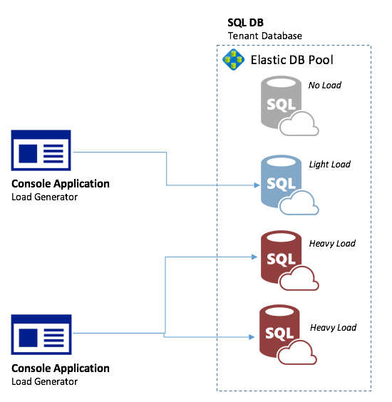
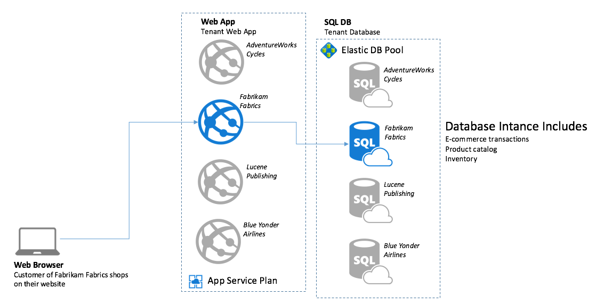

SaaSApp-ContosoShopkeeper
=========================

Pre-Requisites

The requirements for building the solution are as follows:

-   Visual Studio 2015 Update 1 or later

-   Azure Subscription

Solution

The focus of this quick start is on leveraging Elastic Pools and understanding how the support the backend for a SaaS application like Contoso ShopKeeper, the design and implementation of the App Services component is considered out of scope. Since the best way to understand the behavior of Elastic Pools is to experience using them under load, we provide a load generator. The load generator is a console application that targets one or more elastic database instances in an Elastic Pool with a specific write load. You can run multiple instances of the load generator with different settings if you want to create a blended load, e.g., a mix of heavy a light load. In addition, you do not need to target all databases in the pool by the load generator, so you can leave databases you choose without any load.

Scenario

Contoso Shopkeeper provides businesses small and mid-size, an easy-to-use, cost-effective shopping virtual store front and e-commerce solution that merchants can use to sell their products online. ShopKeeper is a multi-tenant Software-as-a-Service (SaaS) application that is entirely hosted in Azure and managed by Contoso on behalf of their merchant customers.

The fundamentals behind the architecture of ShopKeeper are resource sharing amongst tenants (which helps keep costs down for both Contoso and its merchant customers), and isolation between tenants (which aims to guarantee that one merchant's code or data is never mixed in with anothers). Take the example below, where a customer is using her Web Browser to shop Fabrikam Fabrics. In the process of placing an order she would be interacting with a Web App that only contains Fabrikam Fabric’s code, and the Web App would interact with the database instance that only contains Fabrikam Fabric’s data- this is the isolation aspect. The fact that various Web Apps share the resources from an App Service Plan or that multiple SQL Databases instances share resources from an Elastic Pool demonstrates the resource sharing aspect.

